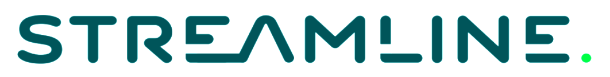

  
  
  
  
  

# RecSys 2017 Hands-on Online Ranking Tutorial

Traditional recommender algorithms may periodically rebuild their models, but they cannot adjust to quick changes in trends caused by timely information.
In contrast, online learning models can adopt to temporal effects, hence they may overcome the effect of concept drift in non-stationary online environments.

In our tutorial, we present open source systems capable of updating their models on the fly after each event: Apache Spark, Apache Flink and [Alpenglow](https://github.com/rpalovics/Alpenglow), a C++ based Python recommender framework.
Participants of the tutorial will be able to experiment with all the three systems by using Zeppelin Notebooks.

Our final objective is to compare and then blend batch and online methods to build models providing high quality top-k recommendation in non-stationary environments.

**The hands-on tutorial running parallel to the workshops is on Sunday, Aug 27, 2017.
Participants may attend the tutorial in two identical sessions starting from either 9:00 or 14:00.
Both sessions start with installation instructions, that is crucial to participate.
Participants must register for the tutorial via this [form](https://goo.gl/forms/LcXCjr5mByWx1QUA2).**

## Installation

Check the [wiki page](https://github.com/rpalovics/recsys-2017-online-learning-tutorial/wiki) for the detailed installation guide.

  

## Theoretical background

A brief summary of the tutorial's theoretical background is now [available](https://github.com/rpalovics/recsys-2017-online-learning-tutorial/raw/master/docs/summary.pdf).

Participants should check out the summary before attending to the tutorial, as during the event there will be less emphasis on the theoretical background.

A preview of the introductory slides are now [available](https://github.com/rpalovics/recsys-2017-online-learning-tutorial/raw/master/docs/intro.pdf).

## Dataset

Download the tutorial data from [here](https://drive.google.com/open?id=0B_3Dz2J_fhmTaVZyUy12cGFQR0E).

## Notebooks

- 1 [Alpenglow online ranking notebook](https://www.zepl.com/viewer/notebooks/bm90ZTovL3JwYWxvdmljcy8zNTk0NmUzMTQwNTU0NTc1YmIzNGIyODJhNjhjNzA5MS9ub3RlLmpzb24)
- 2 Alpenglow/Flink/Spark batch notebook
- 3 Flink parameter server based streaming SGD notebook

  
  
   

